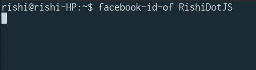

# 
<p align="center">
	<br>
	
	<br>
	<a href="https://travis-ci.org/CodeDotJS/facebook-id-of">
	
	</a>
</p>

> Easily find User ID of any facebook user directly from command line

## Install

```
$ [sudo] npm install --global facebook-id-of
```

`Required NodeJS version` __`^4`__

## Usage

```
$ facebook-id-of

	Usage :   facebook-id-of <username>

	Example : facebook-id-of RishiDotJS

	Help :    facebook-id-of -h --help

```

## Related

- __[`FacebookID`](https://github.com/CodeDotJS/facebookid) :__ `API to find UserID of a facebook user`

## License

MIT © [Rishi Giri](http://rishigiri.com)